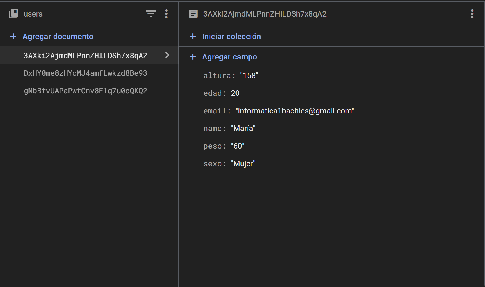
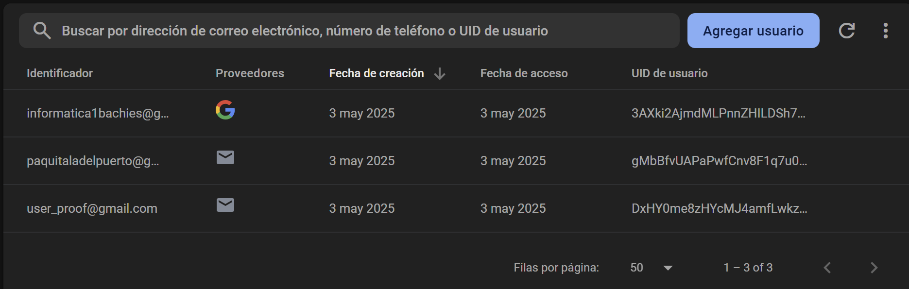

# Fitness App
## Componentes
- Santiago Concepción Estévez
- María Cabrera Vérgez
- Mohamed El Ouariachi Lamhamdi
## Descripción
> Este proyecto está diseñado para ofrecer una gestión completa de rutinas de entrenamiento a usuarios que deseen llevar un
> control eficaz de su progreso físico. Con una interfaz intuitiva y un sistema de suscripciones,los usuarios podrán planificar,
> seguir y gestionar sus rutinas de entrenamiento de forma sencilla y eficiente.

## Requisitos funcionales:

- Creación de rutinas de ejercicio.
- Editar rutinas creadas.
- Borrar rutinas creadas.
- Poder suscribirse para obtener ventajas, rutinas de profesionales.
- Poder ver rutinas creadas.
- Poder iniciar sesión en tu perfil con tus datos.
- Tener varios roles usuario, profesional, etc.
## Mockups y Storyboard

Mockup_Desktop -> /Figma/Mockups/Desktop 

Mockup_Tablet -> /Figma/Mockups/Tablet 

Mockup_Mobile -> /Figma/Mockups/Mobile 

>[!NOTE]
En esta carpeta se encuentran todos los png de los mockups

>

Storyboard -> /Figma/Storyboard/storyboard.png

## Listado de Templates
> [!NOTE]
> Todos los archivos se encuentran en "/Figma/Templates"
- Edit_and_delete_Rutine
  - Edit_rutine
- Footer
  - Se usa en todas
- Header
  - Se usa en todas
- Image_and_text
  - First_page
  - Pro_rutine
- Info_exercise
  - Create_rutine
  - Rutine
- Login
  - Login
  - Main_page
  - Register
- Subscription
  - Select_Payment_Plan

## Listado de paginas web
- Calendar.html -> Calendar
- Create_rutine.html -> Create_rutine
- Day_edit.html -> Day_edit
- Edit_rutine.html -> Edit_rutine
- First_page.html -> First_Page
- Login.html -> Login
- Main_page.html -> Main_Page (Pagina de inicio)
- Payment.html -> Payment
- Pro_rutine.html Pro_rutine
- Profile.html -> Profile
- Register.html -> Register
- Rutine.html -> Rutine
- Select_Payment_Plan.html -> Select_Payment_Plan
- Payment.html -> Payment

## Formularios

Se han implementado dos formularios:

- Login
  - Formulario donde puedes iniciar sesion con correo y contraseña
  - Validaciones
    - Comprueba que la contraseña tenga una longitud minima(8 caracteres)
    - Comprueba que el correo electronico usado este en la base de datos
    - Comprueba que la contraseña introducida sea identica a la que hay guardada en la base de datos
- Registro
  - Formulario donde se pueden registrar nuevos usuarios introduciendo nombre, correo electronico, contraseña y repetición de contraseña
  - Validacion
    - Comprueba que la contraseña tenga una longitud minima(8 caracteres)
    - Comprueba que la contraseña y la contraseña repetida sean iguales

## Acceso a Strapi
> Para poner en funcionamiento Strapi tiene que acceder al directorio backend y ejecutar los siguientes comandos

- npm install
- npm run develop

> Una vez este en funcionamiento podra acceder con los siguientes datos
- Correo = admin@gmail.com
- Contraseña = 1234qweR

> [!NOTE]
> Version de node usada 20.15.0

## Enlaces

## TrainFlow

Para probar el proyecto, ejecute "cd angular" y luego "ng serve"

## Componentes
- **MainPage**: Muestra la página inicial desde la que hay acceso a diferentes apartados de la web.
- **Login**: Permite a los usuarios acceder a sus cuentas.
- **Register**: Permite a los usuarios crearse una cuenta nueva.
- **Edit-Profile**: Da la opción al usuario de cambiar los datos de su perfil: nombre, edad, peso, altura.
- **Calendar**: Calendario que pueden ver para planificar sus rutinas.
- **First-page**: Página a la que acceden los usuarios tras acceder a sus cuentas.
- **Routine-List**: Lista de rutinas del usuario, dónde puede seleccionar si eliminar, editar o crear una rutina.
- **Routine-Form**: Formulario de creación o ediciñon de las rutinas.
- **Payment**: Pasarela de pago.
- **Pro-rutine**: Muestra rutinas seleccionadas del plan de pago.
- **Routine**: Muestra las diferentes rutinas predefinidas disponibles a partir de un selector.
- **Select-Payment-Plan**: Muestra los distintos planes que el usuario puede adquirir.

## Servicios
- **UserService**: Contiene las funciones necesarias para que un usuario pueda hacer login, registrarse, hacer logout o acceder a la web por medio e una cuenta de google.
- **CreateRoutineService**: Contiene funciones necesarias para leer, escribir y actualizar en la base de datos con el fin de acceder a las rutinas.
- **RoutineService**: Contiene las funciones que se encargan de obtener las rutinas de la base de datos, ya sea de las generales o las de los propios usuarios
- **ExerciseService**: Contiene las funciones que nos permiten acceder a los diferentes tipos de ejercicio teniendo en cuenta su grupo muscular.
- **CargaService**: Contiene una función que obtiene los datos necesarios para la carga dinámica de datos  

## Interfaces
- **Exercise**: Interfaz que representa los datos de los ejercicios.
- **Routine**: Interfaz que representa las rutinas de ejercicios.
- **User**: Interfaz que representa los datos del usuario.

## Estructuras de datos en firebase

- **users**(Database): En la base de datos se guardan el nombre, correo, edad, peso y altura indicados en el momento del registro. En caso de no indicarlo, saldrá un mensaje señalándolo.
 
- **users**(Authentication): Aparecen los usuarios que han accedido a la web con sus cuentas. Los datos que se pueden ver son el correo como el identificador, el medio (correo o google), la fecha de creación y acceso.
 
En caso de ocurrir algún error en el login por medio de google, llegará un correo a la cuenta encargada (fitness.app.pwm@gmail.com).
- **exercises{muscular_group}** (Database): Existen varias colecciones de ejercicios, una para cada grupo muscular, que contiene un nombre, una parte del cuerpo, un equipamiento, un id, unas intrucciones, un target y un array con los grupos musculares secundarios.
- **rutinas** (Database): Tenemos una serie de rutinas con su nombre, descripción, duración, tipo y un array con ejercicios y repeticiones.
- **user_routines** (Database): Esta colección agrupa rutinas, pero en este caso son solo aquellas creadas por el usuario. Contiene los mismos campos que la colección "rutinas" pero además posee un id del usuario que la creó.
- **data** (Database): Esta collección contiene una serie de datos que se cargarán en nuestra aplicación, como por ejemplo los textos del header.
